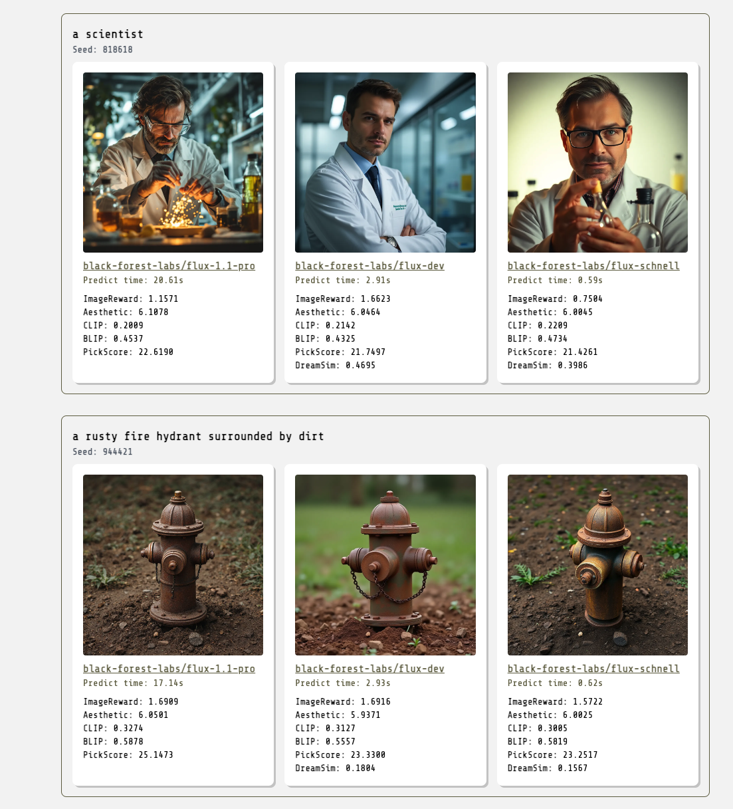

# img-quality-eval

https://img-quality-eval.onrender.com/

Web app that compares the quality of generative text-to-image models.

## Features

* Generate images using Replicate models, or upload a dataset of existing images
* Evaluate prompt/image quality using CLIP, BLIP, Aesthetic, ImageReward, and PickScore using [FlashEval](https://replicate.com/andreasjansson/flash-eval)
* Evaluate image similarity using [DreamSim](https://replicate.com/andreasjansson/dreamsim)
* Evaluation results are stored in a database and can be shared
* Evaluations can be created using a web form or an API
